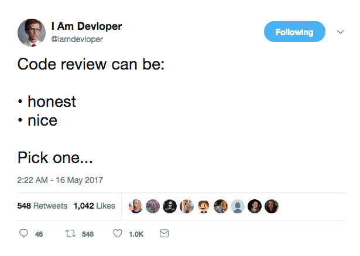

layout: true

.header[@jstoebel]

---
class: center,middle
# Honesty, Kindness and Inspiration: Pick Three

---
class: center,middle
# Jacob Stoebel (@jstoebel)

---
class: middle, center

???
This seems to be the attitude among many developers: I can either 

- Give you feedback that is touchy feely and makes you feel good but is useless or 
- We can get some **real** work done but I will make you feel like garbage. 
- The Tweet received several objections from people wondering aloud why feedback can't be both honest **and** kind.
- Many employers seeking high code quality have created cultures that encourage code reviews leaving developers feeling unappreciated, overly criticized and, ultimately, burned out.
- Women, people of color and developers from other marginalized groups have documented overly harsh, unproductive code reviews that seem more combative than productive. 
- Some developers from those same groups have identified a double standard, where if _they_ were to give overly critical code reviews, they would be dismissed as angry, pushy or difficult to work with.

---
class: middle
# Toxic Code Reviews: Some Examples

Paraphrased from Erik Dietrich (@daedtech)

???
- There's a great blog article by Erik Dietrich called "How to Use a Code Review to Execute Someone’s Soul" that lists some of flavors of toxic code reviews

---
class: middle
# Nit picking session

How to name variables, how to organize files, clever one liners...

???
- **Nit picking session:** Where we spend a lot of time pointing out little things about the code. 
- I don't think code reviews are the best place for this sort of thing (linters are better)
- So much of the stuff like this can come up as opinion disguised as fact. "I think local variables should be lowercase_underscored" becomes "variables in ruby should be underscored".
- There can also be pressure as a reviewer to find something, _anything_ wrong with the code. If I don't will my co-workers think I'm lazy or incompetent? The result is a deluge of hot takes that can bury the important stuff. Its also not a great use of time.
---
class: middle

# Marathon

Let's go over every line and discuss _ad nauseum_

???
**Marathon:** where we go over everything _ad nauseum_. This may sound harmless enough but 1) do we really have time for that and 2) I've known people in my professional life that are able to get their way simply by talking the longest. When an argument ensues they just dig in their heels for as long as it takes until the opposing party can't go on (tired, hungry, need to pick up their kids, etc.) and they win by default.
---
class: middle
# Firing Squad
Find everything you did wrong. 

# The Exit Exam 
The code review is something to be "passed".

???
**Firing squad and Exit Exam:** where the relationship becomes adversarial. I am going to try to poke as many holes in your code as I can to find deficiencies. Your code either "passes" and gets merged in or "fails" and it doesn't. I think this can have some serious side effects.
---
class: center, middle

# Don't take it personally

???
- You can spot a toxic code review when its defended using something along the lines of "I'm just focused on the code. Don't take it personally."
- I find this framework particularly concerning because it opens the door to toxic criticism.
- While I agree that as developers we might not want to be _too_ attached to our code, I think the phrase "Don't take it personally" is flawed. We are thought workers after all, and our code is a reflection of the way we view the world. The assumption that we can completely compartmentalize doesn't seem possible to me.
- In a toxic environment where teams don't trust each other we could imagine all kinds of abusive behavior justified with the "don't take it personally" defense.
- "I'm not a nice person, and I don't care about you. I care about the technology and the kernel—that's what's important to me." ~ Linus Torvalds

---
class: middle, center

# The Brilliant Jerk

???
- I've given this talk before and I've been asked the question "But Linus Torvalds has created so much. For that matter so did Steve Jobs. Aren't brilliant jerks just something worth living with". 
- For one thing, I think this ignores the externalities involved when people in power are allowed to abuse that power under the excuse that their output is so great. Those externalities could include:
    - team burnout, people being afraid to speak out or make mistakes (we're a creative profession we need to have _some_ freedom to fail). 
    - This can be from the jerk, but also from others due to the negative culture that they contribute to. 
    - At its worst there's sexual harassment, discrimination workplace bullying and sexual assault just to name a few. If you add all of that up, are brilliant jerks still worth it?
- At its most fundamental level though, I'm not convinced we can ask team mates to just leave their emotions at the door. There is a large body of research out there that we are, at a neurological level, emotional creatures. Emotions are a fundamental part of who we are.

---
class: middle, center
# Other code review anti-patterns
???
 There's more. I've used this talk as an excuse to ask lots of people what they think about code reviews. If they don't like them I ask why. Here's some of what I found.

---
class: middle, center
# The bottle neck
???
**Bottle neck**: A single person on the team is responsible for reviewing everyone's code, nothing can go forward until they are satisfied. As a result, people start writing their code with the objective of getting it past that person "don't do it that way ___ won't like it."

---
class: middle, center
# Reviewer doesn't have enough context
???
Other teams like to have an **outside person* handle their code reviews. I think this is interesting because you're bringing in a fresh perspective. Problems can happen when the reviewer doesn't have enough context before they start diving in. The review ends up being like a copy editor marking up all of your typos, but not able to give higher order feedback because they don't understand the larger system.
---
class: middle, center
# Reviewer too close to project

???
On the other hand, a reviewer that is **too close** to the work might be to deep into the work in order to see the bigger picture. They miss the forest for the trees.
---
class: middle, center

#Summative rather than formative

???
Code reviews that are **summative** (happening at the end of the process) have been seen as less effective. After all, would you rather get feedback on a big chunk of work you wrote 2 weeks ago, a small chunk of work you wrote yesterday?

---
class: middle, center
# Too asynchronous
???
Code reviews being **Too asynchronous** is a legitimate challenge too. Let's say I make a commit on Monday afternoon and my colleague starts reviewing it on Tuesday. But then they have a family emergency and have to leave early and don't get around to finishing it until late Wednesday. By then, things have changed, an of course the code will have to as well, and my poor team mate wasn't alerted so his code review is all for naught. Repeat.
---
class: middle, center
# Homework
???
Several blogs I've read have talked about code reviews as a burdensome pile of **homework**. Every time you get through it (on top of doing your own work) another huge pile is dumped into your inbox. 
---
class: middle, center
# Required for every commit
???
Some people have shared that their company has **Code Review required for every commit**. I see the intuition in this: having a human reviewing code as a step in your CI process. But unlike a CI server humans don't handle context switching very well. If I have to stop what I'm doing to approve your trivial change, that comes with a cost and that cost may not be worth it.
---
class: middle, center
# No one believes in the process
???
 - All of this, and more can lead to **teams losing faith in the code review** process. When we have to use a work flow we don't believe in, of course its not going to go well.
  - Where does that leave us? There needs to be some way to help each other arrive at the best code possible.
---
class: middle

# Poop Sandwich

_I really liked how you did X, but that part where you did Y, was not so good. You should do Z instead. ...But on the whole I loved how it was ..._

???
- The poop sandwich approach is a _little_ bit better. It helps develop trust within teams because the stuff that's hard to hear is padded between two nice things.
- In a past life, I was a high school drama teacher. Balancing critical feedback with kindness was something always at the forefront of my mind.
- The problem was that the receiver of the feedback sometimes thought of it like a report card: "I got two good grades and one bad one. On the whole I've got a decent GPA."
- The creator thought of the good spots as as uniformly good, not needing change and the bad spots as unfixable, impossible to get any better at.

---
class: middle
## Liz Lermon Critical Response Process
_Objective: inspire the creator to go back to their work with fresh eyes, excited about making their creation even better._

???
- Lerman proposes that the concept of balancing kindness and honesty is a false dichotomy. Really its about inspiration: inspiration to to go back to the work and make it even better.
- This story takes us to, believe it or not the dance world. The dance world was and is notoriously harsh in its culture of feedback. Lerman wanted a framework where creators were encouraged to think critically about their work and _wanted_ to revise it as opposed to earning a "good grade" in order to further their career.
- This makes sense: if you're number one objective is to earn a "good grade", what impact would you expect on creativity?
- The Critical Response Process has been used by artists, administrators, scientists, academics, and even in the corporate sector. It isn't constrained to works that we would traditionally call "Art". Really, its for anything creative. Software is a perfect use case for this!

---
class: middle, center

# The roles

 1. The creator(s)
 2. The responder(s)
 3. Facilitator

???
1. The creator(s): people directly responsible for the work.
2. The responder(s): offering their honest, encouraging feedback to the work.
3. Facilitator: keeps us on track by following the framework.
Roles can sometimes get blurred.

---
class: middle

## Step 1: Statements of Meaning
What about the work had meaning. Not evaluative.

???
There are four steps to this feedback process:

Step 1: Responders state what about the work had meaning, was interesting or stood out. We can think of this as a way to generate material of what to talk about in more depth later in the process. The important part here is that statements are not evaluative in this step. We save those for later.

There's a great talk from RailsConf 2016 by Nadia Odunayo called _The Guest: A Guide To Code Hospitality_ In it, she proposes that we think about introducing a person to a code base in the same way that a host welcomes a guest into their home. If you are a guest in someone's home you probably wouldn't, upon walking into their home for the first time point out the dirty clothes on the floor. 
---
class: middle

## Good Example
"I noticed that this code is written in a functional style"
???
- Good example: "I noticed that this code is written in a functional style"
---
class: middle

## Bad Example
"This version of Rails is out of date. You should update to Rails 5"

???
- Bad Example: "This version of Rails is out of date. You should update to Rails 5"
- To be clear: this process isn't trying to somehow silence important criticism. It only asks that those opinions be saved for later.
---
class: middle

## Step 2: Questions From the Creator(s)
Responders may give their opinion about things explicitly asked about.

???
- This process aims to put the creator in the driver's seat. That's why the creator gets to go first by asking questions: they get to steer the conversation in the direction that is most useful for them
- Responders may give their opinion about things explicitly asked about.

---
class: middle
## Step 2: a good example

In the docs was it clear to you what this method does? If not how could I make it more clear.

???
a good example

Q: In the docs was it clear to you what this method does? If not how could I make it more clear.

---
class: middle

I think I understand how to call the method but not why. Maybe think about including an example use case.

---
class: middle
## Step 2: a not so good example

No, and in general the docs were not so well organized. The way you should organize it is...

???
a not so good example
A: No, and in general the docs were not so well organized. The way you should organize it is…
This is out of scope of the original question. Responders should answer the question and nothing else.

---
class: middle

## Step 3: Neutral Questions from Responder(s)

Purpose: to understand the context of the work. **Should not have an embedded opinion.**

???
Step 3: Neutral Questions from the Responders
Responder ask questions to make sure they understand the full context. Questions should not have an embedded opinion.

 - To continue that analogy of having a guest in your home, let's say your about to take a shower in the guest bathroom and there's no hot water. You probably wouldn't ask "why's there no hot water?". Instead you might say something like "is there something special I should know about the hot water in the shower" You're leaving a space for the possibility that there may be something special about the house you don't understand ("the hot water takes a long time to come out", "I just took a shower and were out sorry!", etc)

**If you’ve ever given a talk and had someone give a critique disguised as a question, you know what this is.**

---
class: middle

## Good Example
"What ideas guided you to select FactoryBot for this project?"
???
Good Example: "What ideas guided you to select FactoryBot for this project?"
---
class: middle
## Bad Example
"What were you thinking when you chose FactoryBot for this project?"

???
Bad Example: "What were you thinking when you chose FactoryBot for this project?"

Starting a sentence with “what were you thinking” makes your opinion clear. Opinions come at the end. Which brings us to...

---
class: middle

## Step 4: Opinions

Responders may give their opinions on the work **with the consent of the creator(s).**

???
Step 4: Opinions
Here's where responders may give their opinions on the work with the consent of the creator(s).

---
class: middle

**RESPONDER** I have an opinion about response times in production. Would you like to hear it?

**CREATOR** Sure!

**RESPONDER** _opinion here_

---
class: middle

**RESPONDER** I have an opinion about the use of FactoryBot in this project, would you like to hear it?

**CREATOR** No thanks!

_moving on..._

???
This process believes that the creator knows best how the conversation should be steered in order to yield the best results. It trusts that the creator can see when the conversation is going down an unproductive path and gives them the power to redirect.
---
class: middle, center

# FAQs
???
The nice thing about this framework is that its flexible. For example, here are some questions I've gotten.
---
class: middle

Would this work on Github or Slack?

???
Github no. Slack maybe, if everyone can agree to participate at the same time. We are a profession that loves asynchronous work, but the spirit of this process is that great feedback happens when everyone is in the same space with each other (real or virtual).
---
class: middle
Does this mean I can say "no thanks" to my manager's opinions?

???
 - Does this mean I can say "no thanks" to my manager's opinions? The answer is, probably not, but it does mean you and your manager can establish a shared understanding of when and how feedback should be given. Opinions (so long as they are thoughtful and well timed) are allowed based on the working relationship.

---
class: middle

This framework seems rigid. Does it have to be?
???
 - Another critique I hear about this framework is that it seems too rigid to be practical. For example:
     + people say their team would prefer the code review to be a more fluid discussion. That's fine. A facilitator familiar with this approach can skip forward and backward into this process based on the needs of the group. 
     + Its also possible to use this process when not everyone knows it by name. If, as a responder you ask questions before giving your opinion, that's a win. If, as a creator, you are guiding the conversation with your questions about the work, that's a win.
     + I gave this talk at my local meet up recently and one person commented after that "great teams do this naturally without a name for it". I think that's totally true
---
class: middle

Do you really expect jerks to go along with this?
???

 - Another question totally disguised as opinion is "Do you really expect jerks to go along with this?" Honestly, I don't. But I also think / hope that in an work environment that isn't completely toxic, there may be some people that will refuse to do this, but there's hopefully more people that _would_ do it if they knew how.
 - While there is formal training on this (I did a day long training with Lerman) you don't need it to get started. Consider yourself empowered to encourage this at your organization.

---
class: middle

Are there ever times where this framework wouldn't be the most efficient?

???
 - Another question I've gotten before is "Is this process always the best approach?" If your network is down, you probably want to get it back up first as fast as possible without having a long discussion about it. But a debrief on the incident later on would be a perfect opportunity to use this process to explore how we can learn from the incident in a non judgmental environment. 

---
class: middle

# Recap

 1. Statements of Meaning
 2. Questions from Creator
 3. Neutral questions from responders
 4. Opinions with consent of creators

---
name: resources
# Resources
 - [https://lizlerman.com/critical-response-process/](https://lizlerman.com/critical-response-process/)
 - _Liz Lerman's critical response process: A method for getting useful feedback on anything you make, from dance to dessert_, Liz Lerman and John Borstel (2003)
 - [http://www.jstoebel.com/honesty-kindness-and-inspiration-pick-three/](http://www.jstoebel.com/honesty-kindness-and-inspiration-pick-three/)
 - [https://www.daedtech.com/how-to-use-a-code-review-to-execute-someones-soul/](https://www.daedtech.com/how-to-use-a-code-review-to-execute-someones-soul/)
 - [https://www.youtube.com/watch?v=hHzWG1FltaE](https://www.youtube.com/watch?v=hHzWG1FltaE)

---
layout: true
---
class: middle

# Jacob Stoebel

@jstoebel

[www.jstoebel.com](www.jstoebel.com)

[github.com/jstoebel/critical_response_talk](github.com/jstoebel/critical_response_talk)

